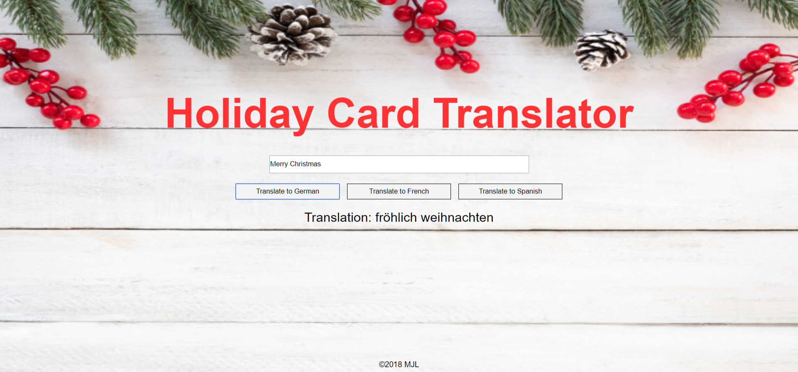
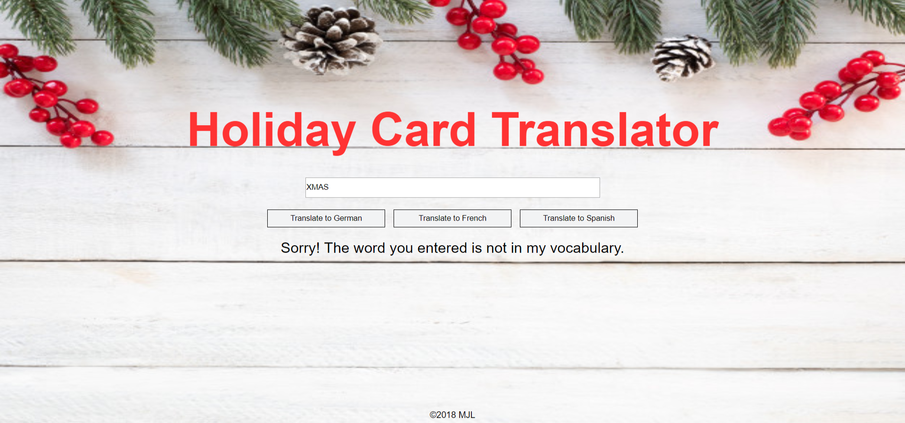

# Holiday Translator

## Description
This project uses javascript to practice iteration over array and searching objects to translate a holiday greeting into a different language.

## Screenshots
1. Overview

2. Translation

3. Error Message


## How to run this project
* Use npm to install http-server in your terminal:
```sh
npm install -g http-server
```
* Run the server in your terminal
```sh
hs -p 9999
```
* Open chrome and navigate to:
```
localhost:9999
```

## Contributors
[Maggie Leavell](https://github.com/mjleavell)